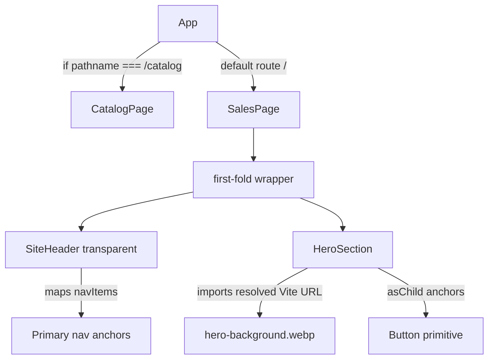

# First Section: Paper Header + Hero Background — Planning Output (v1)

> **Status:** PLANNED — Awaiting approval  
> **Date:** 2026-06-09  
> **Scope:** `/` home route first fold: Paper `Global Header / Nav` + `Section 01 / Centered Hero`  
> **Files:** 4 files planned (1 new planning doc, 2 modified app files, 1 verified/reused asset)  
> **Risk:** 🟡 MEDIUM

---

## 1. Contexto

The home route still renders the Vite starter screen. The Paper MCP source of truth now identifies the first landing-page fold as:

- `Global Header / Nav`, 1440 x 96.
- `Section 01 / Centered Hero`, 1440 x 700.

User requirements captured for this adjustment:

- Develop the first LP section from the Paper section.
- Use `/Users/brunogovas/Projects/Projetos Solo/personal-sales-page/src/assets/Frame Inicial.png` as the background source image.
- Translate that PNG to WebP for web usage.
- Make the header background transparent.
- Reuse existing components and assets; do not create design-system components from scratch.

Current local validation:

- `/Users/brunogovas/Projects/Projetos Solo/personal-sales-page/src/assets/Frame Inicial.png` exists as a 1672 x 941 PNG.
- `/Users/brunogovas/Projects/Projetos Solo/personal-sales-page/src/assets/hero-background.webp` already exists as a 1672 x 941 WebP generated from `Frame Inicial.png`.
- No `SiteHeader`, `Header`, `SalesPage`, or `Hero` implementation file exists yet.
- `squads/`, `.aios/`, and `aios-core/` are not present in this project; this plan continues as a local AIOS-compatible planning output.

Technical mapping:

- **Issue:** `/` still uses starter Vite content instead of the Paper first fold.
- **Suspected Root Cause:** `src/App.tsx` has not yet been replaced with the LP composition.
- **Target Outcome:** `/` renders a transparent header over a hero section that uses the WebP version of `Frame Inicial.png` as a responsive background; `/catalog` remains available.
- **Risks & Mitigation:** Replacing starter markup and root styles can affect `/catalog` and responsive layout. Mitigate by preserving the `/catalog` branch, scoping new CSS under `.sales-page`, and validating build plus visual desktop/mobile routes.

Risk classification:

```text
Point #1: Implement Paper first fold with transparent header and WebP background
├── Risk Level: 🟡 MEDIUM
├── Blast Radius: / home route, App.css, root first-fold layout
├── Regression Surface: /catalog route preservation, asset imports, responsive hero/header rendering
└── Confidence: HIGH based on Paper extraction, existing catalog patterns, and verified assets
```

---

## 2. Referência de Código Mapeada

### 2.1 Paper Source: Header Structure

Paper MCP extraction from `personal-sales-page — Portfolio Sales Wireframe` / `Global Header / Nav`.

```tsx
<div style={{
  alignItems: 'center',
  backgroundColor: '#FFFFFF',
  borderBottomColor: '#E6ECF2',
  borderBottomStyle: 'solid',
  borderBottomWidth: '1px',
  display: 'flex',
  height: '96px',
  justifyContent: 'space-between',
  paddingInline: '96px',
  width: '100%'
}}>
  <div>
    <div>BRUNO CASTELANI</div>
    <div>Product Developer / Marketing Automation</div>
  </div>
  <div>
    <div>Início</div>
    <div>Resultados</div>
    <div>Perfil</div>
    <div>Projetos</div>
    <div>Contato</div>
  </div>
</div>
```

↑ Reuse the structure, copy, spacing intent, and navigation labels. Adapt `backgroundColor: '#FFFFFF'` to `background: transparent` per user request.

### 2.2 Paper Source: Centered Hero Structure

Paper MCP extraction from `personal-sales-page — Portfolio Sales Wireframe` / `Section 01 / Centered Hero`.

```tsx
<div style={{
  alignItems: 'center',
  backgroundColor: '#FFFFFF',
  borderBottomColor: '#E6ECF2',
  display: 'flex',
  flexDirection: 'column',
  gap: '34px',
  justifyContent: 'center',
  minHeight: '700px',
  paddingBottom: '54px',
  paddingInline: '96px',
  paddingTop: '78px',
  width: '100%'
}}>
  <div style={{ alignItems: 'center', display: 'flex', flexDirection: 'column', gap: '24px', width: '930px' }}>
    <div>5+ anos em desenvolvimento, marketing e automações</div>
    <div>Eleve seu Time de Produtos para o Próximo Nível.</div>
    <div>
      Sales page pessoal com foco em produto, código, marketing e automações.
      A primeira dobra precisa explicar rapidamente por que Bruno é um bom fit.
    </div>
  </div>
</div>
```

↑ Reuse the centered content model, `700px` minimum hero height, headline/copy hierarchy, and CTA content. Adapt the white background to a WebP background image.

### 2.3 Current Home Route To Replace

[App.tsx L1-L13](file:///Users/brunogovas/Projects/Projetos%20Solo/personal-sales-page/src/App.tsx#L1-L13)

```tsx
import { useState } from 'react'
import reactLogo from './assets/react.svg'
import viteLogo from './assets/vite.svg'
import heroImg from './assets/hero.png'
import CatalogPage from './CatalogPage'
import './App.css'

function App() {
  const [count, setCount] = useState(0)

  if (window.location.pathname === '/catalog') {
    return <CatalogPage />
  }
```

↑ Remove starter-only state and starter asset imports. Preserve the `/catalog` route branch exactly.

### 2.4 Local Page Map: First Section Intent

[CatalogPage.tsx L158-L170](file:///Users/brunogovas/Projects/Projetos%20Solo/personal-sales-page/src/CatalogPage.tsx#L158-L170)

```tsx
const pageSections = [
  {
    section: 'Header',
    intent: 'Logo, compact navigation, clear primary action',
    base: 'Button, logo asset',
    status: 'Ready asset',
  },
  {
    section: 'Hero',
    intent: 'Immediate positioning for personal sales and product-design work',
    base: 'Button, Badge, image background',
    status: 'Ready assets',
  },
```

↑ Use this local map to keep the first implementation scoped to Header + Hero.

### 2.5 Asset Inventory: PNG Source Already Mapped

[CatalogPage.tsx L229-L239](file:///Users/brunogovas/Projects/Projetos%20Solo/personal-sales-page/src/CatalogPage.tsx#L229-L239)

```tsx
{
  name: 'Frame Final BG',
  file: 'src/assets/Frame Final BG.png',
  usage: 'Approved project visual',
  image: frameFinalBg,
},
{
  name: 'Frame Inicial',
  file: 'src/assets/Frame Inicial.png',
  usage: 'Approved project visual',
  image: frameInicial,
},
```

↑ Confirms `Frame Inicial.png` is already recognized as an approved visual asset.

### 2.6 WebP Readiness Reference

[2026-06-09-webp-assets-readiness.md L5-L16](file:///Users/brunogovas/Projects/Projetos%20Solo/personal-sales-page/docs/sessions/2026-06/2026-06-09-webp-assets-readiness.md#L5-L16)

```md
- Converted referenced bitmap assets to WebP copies:
  - `src/assets/Frame Inicial.png` -> `src/assets/hero-background.webp`
  - `src/assets/Frame Final BG.png` -> `src/assets/footer-background.webp`
  - `src/assets/Component 1.png` -> `src/assets/logo.webp`
  - `src/assets/super-geeks-unifesp-univap.png` -> `src/assets/super-geeks-unifesp-univap.webp`
  - `src/assets/proff-diagram.png` -> `src/assets/proof-diagram.webp`
  - `src/assets/App-preview.png` -> `src/assets/app-preview.webp`
  - `src/assets/Funnel-preview.png` -> `src/assets/funnels-preview.webp`
  - `src/assets/design-systems-preview.png` -> `src/assets/design-systems-preview.webp`
  - `src/assets/WhatsApp Image 2026-01-05 at 10.01.22.jpeg` -> `src/assets/bruno-portrait.webp`
```

↑ Treat `/src/assets/hero-background.webp` as the translated WebP target for `Frame Inicial.png`; do not delete or overwrite originals.

### 2.7 Existing Catalog Header Pattern

[CatalogPage.tsx L408-L421](file:///Users/brunogovas/Projects/Projetos%20Solo/personal-sales-page/src/CatalogPage.tsx#L408-L421)

```tsx
function CatalogPage() {
  return (
    <main className="catalog-page">
      <header className="catalog-topbar">
        <a className="brand-link" href="/" aria-label="Back to home">
          
          <span>Design System</span>
        </a>
        <nav aria-label="Catalog navigation">
          <a href="#components">Components</a>
          <a href="#assets">Assets</a>
          <a href="#decisions">Decisions</a>
        </nav>
      </header>
```

↑ Reuse semantic `header`, logo link, and `nav` approach for the LP header.

### 2.8 Existing Catalog Hero + Button Pattern

[CatalogPage.tsx L423-L443](file:///Users/brunogovas/Projects/Projetos%20Solo/personal-sales-page/src/CatalogPage.tsx#L423-L443)

```tsx
<section className="catalog-hero">
  <div className="hero-copy">
    <Badge className="hero-badge">
      <Sparkles size={14} aria-hidden="true" />
      Source of truth
    </Badge>
    <h1>Catalog for every component and design choice.</h1>
    <p>
      A living reference for the personal sales page design system, component inventory,
      chosen tokens, approved assets, and implementation notes.
    </p>
    <div className="hero-actions">
      <Button asChild>
        <a href="#components">
          View components
          <ArrowUpRight size={16} aria-hidden="true" />
        </a>
      </Button>
      <Button asChild variant="outline">
        <a href="#decisions">Read rules</a>
      </Button>
```

↑ Reuse `Button asChild` and paired CTA pattern. Do not create local button mocks.

### 2.9 Design-System Button Primitive

[button.tsx L41-L62](file:///Users/brunogovas/Projects/Projetos%20Solo/personal-sales-page/components/ui/button.tsx#L41-L62)

```tsx
function Button({
  className,
  variant = "default",
  size = "default",
  asChild = false,
  ...props
}: React.ComponentProps<"button"> &
  VariantProps<typeof buttonVariants> & {
    asChild?: boolean
  }) {
  const Comp = asChild ? Slot.Root : "button"

  return (
    <Comp
      data-slot="button"
      data-variant={variant}
      data-size={size}
      className={cn(buttonVariants({ variant, size, className }))}
      {...props}
    />
  )
}
```

↑ Use this existing primitive for both hero CTA actions and avoid hardcoded button components.

### 2.10 Current Global Root Constraint

[index.css L57-L67](file:///Users/brunogovas/Projects/Projetos%20Solo/personal-sales-page/src/index.css#L57-L67)

```css
#root {
  width: 1126px;
  max-width: 100%;
  margin: 0 auto;
  text-align: center;
  border-inline: 1px solid var(--border);
  min-height: 100svh;
  display: flex;
  flex-direction: column;
  box-sizing: border-box;
}
```

↑ The current root width would constrain the 1440px Paper layout. Either scope an override for `.sales-page` or adjust root constraints carefully without breaking `/catalog`.

---

## 3. Lógica de Implementação

### 3.1 Preserve `/catalog` Route And Render LP

**Origem:** `[REPO EXISTENTE]` + `[CRIADO]`

```tsx
function App() {
  if (window.location.pathname === '/catalog') {
    return <CatalogPage />
  }

  return <SalesPage />
}
```

This keeps the existing `/catalog` route intact and replaces only the starter home route.

### 3.2 Static Navigation Data With Stable Keys

**Origem:** `[CONTEXT7]` + `[CRIADO]`

```tsx
const navItems = [
  { label: 'Início', href: '#inicio' },
  { label: 'Resultados', href: '#resultados' },
  { label: 'Perfil', href: '#perfil' },
  { label: 'Projetos', href: '#projetos' },
  { label: 'Contato', href: '#contato' },
]
```

React documentation validates rendering repeated UI from arrays with `map()` and stable `key` values. Here, `href` is stable enough for the nav list.

### 3.3 Header Component With Transparent Background

**Origem:** `[PAPER MCP]` + `[REPO EXISTENTE]` + `[CRIADO]`

```tsx
function SiteHeader() {
  return (
    <header className="site-header">
      <a className="site-brand" href="/" aria-label="Bruno Castelani home">
        
        <span>
          <strong>BRUNO CASTELANI</strong>
          <small>Product Developer / Marketing Automation</small>
        </span>
      </a>

      <nav className="site-nav" aria-label="Primary navigation">
        {navItems.map((item) => (
          <a key={item.href} href={item.href}>
            {item.label}
          </a>
        ))}
      </nav>
    </header>
  )
}
```

The header uses the Paper copy and layout but CSS will set `background: transparent`.

### 3.4 Hero Background Uses WebP Translation

**Origem:** `[CONTEXT7]` + `[REPO EXISTENTE]` + `[CRIADO]`

```tsx
import heroBackground from './assets/hero-background.webp'

function HeroSection() {
  return (
    <section
      id="inicio"
      className="sales-hero"
      style={{ backgroundImage: `linear-gradient(rgba(255,255,255,0.78), rgba(255,255,255,0.86)), url(${heroBackground})` }}
    >
      <div className="sales-hero-content">
        <p className="sales-eyebrow">5+ anos em desenvolvimento, marketing e automações</p>
        <h1>Eleve seu Time de Produtos para o Próximo Nível.</h1>
        <p className="sales-hero-copy">
          Sales page pessoal com foco em produto, código, marketing e automações.
          A primeira dobra precisa explicar rapidamente por que Bruno é um bom fit.
        </p>
        <div className="sales-hero-actions">
          <Button asChild size="lg">
            <a href="https://wa.me/" aria-label="Iniciar conversa pelo WhatsApp">
              Iniciar conversa
              <ArrowUpRight size={16} aria-hidden="true" />
            </a>
          </Button>
          <Button asChild size="lg" variant="outline">
            <a href="#projetos">Ver projetos</a>
          </Button>
        </div>
        <p className="sales-helper">Sem forms, direto no whatsapp</p>
      </div>
    </section>
  )
}
```

Vite documentation confirms importing static assets returns a resolved URL and includes referenced assets in the production graph with hashed output names.

### 3.5 Sales Page Composition

**Origem:** `[CRIADO]`

```tsx
function SalesPage() {
  return (
    <main className="sales-page">
      <div className="first-fold">
        <SiteHeader />
        <HeroSection />
      </div>
    </main>
  )
}
```

`first-fold` groups the transparent header and hero background into one visual surface.

### 3.6 WebP Asset Translation Gate

**Origem:** `[REPO EXISTENTE]` + `[CRIADO]`

```bash
file "src/assets/Frame Inicial.png" "src/assets/hero-background.webp"
ls -lh "src/assets/Frame Inicial.png" "src/assets/hero-background.webp"
```

Expected validated state:

```text
src/assets/Frame Inicial.png:    PNG image data, 1672 x 941
src/assets/hero-background.webp: Web/P image, 1672x941
```

Because the WebP file already exists and matches the PNG dimensions, implementation should reuse `/Users/brunogovas/Projects/Projetos Solo/personal-sales-page/src/assets/hero-background.webp`. Regeneration is only needed if stakeholder explicitly wants the existing WebP overwritten.

---

## 4. Arquitetura de Componentes



---

## 5. CSS/SCSS Reference

### 5.1 Current Starter Home CSS To Replace

[App.css L59-L71](file:///Users/brunogovas/Projects/Projetos%20Solo/personal-sales-page/src/App.css#L59-L71)

```css
#center {
  display: flex;
  flex-direction: column;
  gap: 25px;
  place-content: center;
  place-items: center;
  flex-grow: 1;

  @media (max-width: 1024px) {
    padding: 32px 20px 24px;
    gap: 18px;
  }
}
```

**Adaptações necessárias:**

| Propriedade | Valor Original | Novo Valor |
|-------------|---------------|------------|
| Scope | `#center` starter section | `.sales-page`, `.first-fold`, `.sales-hero` |
| Layout | Starter centered demo | Paper header + hero first fold |
| Background | Inherited root background | WebP hero background from `hero-background.webp` |
| Responsive | Basic `1024px` padding | Desktop 1440 intent + mobile stacked nav behavior |

### 5.2 Current Root Layout Constraint

[index.css L57-L67](file:///Users/brunogovas/Projects/Projetos%20Solo/personal-sales-page/src/index.css#L57-L67)

```css
#root {
  width: 1126px;
  max-width: 100%;
  margin: 0 auto;
  text-align: center;
  border-inline: 1px solid var(--border);
  min-height: 100svh;
  display: flex;
  flex-direction: column;
  box-sizing: border-box;
}
```

**Adaptações necessárias:**

| Propriedade | Valor Original | Novo Valor |
|-------------|---------------|------------|
| `width` | `1126px` | `100%` or sales-page-specific full-width override |
| `border-inline` | starter frame border | remove/neutralize for `.sales-page` only |
| `text-align` | global center | component-level alignment |

### 5.3 Planned First Fold CSS

```css
.sales-page {
  min-height: 100svh;
  background: #ffffff;
  color: #0d2444;
}

.first-fold {
  min-height: 796px;
  background: #ffffff;
}

.site-header {
  position: relative;
  z-index: 2;
  display: flex;
  align-items: center;
  justify-content: space-between;
  height: 96px;
  padding-inline: clamp(24px, 6.67vw, 96px);
  background: transparent;
  border-bottom: 1px solid rgba(230, 236, 242, 0.65);
}

.sales-hero {
  min-height: 700px;
  display: flex;
  align-items: center;
  justify-content: center;
  padding: 78px clamp(24px, 6.67vw, 96px) 54px;
  background-position: center;
  background-size: cover;
  background-repeat: no-repeat;
}
```

---

## 6. Novos Componentes

No new component files are planned for this pass because the design-system mandate requires explicit permission before creating new components/layouts when similar structure can live inside the current route.

### 6.1 Local Function: `SiteHeader`

**Path:** `/Users/brunogovas/Projects/Projetos Solo/personal-sales-page/src/App.tsx`

#### Props

```tsx
{}
```

#### Lógica Core

```tsx
function SiteHeader() {
  return (
    <header className="site-header">
      <a className="site-brand" href="/" aria-label="Bruno Castelani home">
        
        <span>
          <strong>BRUNO CASTELANI</strong>
          <small>Product Developer / Marketing Automation</small>
        </span>
      </a>
      <nav className="site-nav" aria-label="Primary navigation">
        {navItems.map((item) => (
          <a key={item.href} href={item.href}>
            {item.label}
          </a>
        ))}
      </nav>
    </header>
  )
}
```

### 6.2 Local Function: `HeroSection`

**Path:** `/Users/brunogovas/Projects/Projetos Solo/personal-sales-page/src/App.tsx`

#### Props

```tsx
{}
```

#### Lógica Core

```tsx
function HeroSection() {
  return (
    <section
      id="inicio"
      className="sales-hero"
      style={{ backgroundImage: `linear-gradient(rgba(255,255,255,0.78), rgba(255,255,255,0.86)), url(${heroBackground})` }}
    >
      <div className="sales-hero-content">
        <p className="sales-eyebrow">5+ anos em desenvolvimento, marketing e automações</p>
        <h1>Eleve seu Time de Produtos para o Próximo Nível.</h1>
        <p className="sales-hero-copy">
          Sales page pessoal com foco em produto, código, marketing e automações.
          A primeira dobra precisa explicar rapidamente por que Bruno é um bom fit.
        </p>
        <div className="sales-hero-actions">
          <Button asChild size="lg">
            <a href="https://wa.me/" aria-label="Iniciar conversa pelo WhatsApp">
              Iniciar conversa
              <ArrowUpRight size={16} aria-hidden="true" />
            </a>
          </Button>
          <Button asChild size="lg" variant="outline">
            <a href="#projetos">Ver projetos</a>
          </Button>
        </div>
        <p className="sales-helper">Sem forms, direto no whatsapp</p>
      </div>
    </section>
  )
}
```

---

## 7. Componentes Modificados

### 7.1 `App.tsx`

**Path:** `/Users/brunogovas/Projects/Projetos Solo/personal-sales-page/src/App.tsx`

**Removed starter states/hooks:**

```tsx
// Remove:
import { useState } from 'react'
const [count, setCount] = useState(0)
```

**New imports:**

```tsx
import { ArrowUpRight } from 'lucide-react'

import { Button } from '@/components/ui/button'
import CatalogPage from './CatalogPage'
import heroBackground from './assets/hero-background.webp'
import logo from './assets/logo.webp'
import './App.css'
```

**Modified route body:**

```tsx
function App() {
  if (window.location.pathname === '/catalog') {
    return <CatalogPage />
  }

  return <SalesPage />
}
```

### 7.2 `App.css`

**Path:** `/Users/brunogovas/Projects/Projetos Solo/personal-sales-page/src/App.css`

**Replace starter CSS with scoped LP CSS:**

```css
.sales-page {
  min-height: 100svh;
  background: #ffffff;
  color: #0d2444;
}

.site-header {
  background: transparent;
}
```

The full implementation will include responsive typography, nav wrapping behavior, CTA alignment, and contrast overlays around the WebP background.

### 7.3 `hero-background.webp`

**Path:** `/Users/brunogovas/Projects/Projetos Solo/personal-sales-page/src/assets/hero-background.webp`

**Action:** Reuse and verify the existing WebP translation of `Frame Inicial.png`. No overwrite unless approved.

```tsx
import heroBackground from './assets/hero-background.webp'
```

---

## 8. i18n Keys (se aplicável)

Not applicable. The project currently hardcodes copy in Portuguese and does not expose an i18n layer.

### 8.1 Novas Chaves

```json
{}
```

### 8.2 Plano de Verificação Anti-Reversão

```bash
rg -n "Eleve seu Time de Produtos|Sem forms, direto no whatsapp|Iniciar conversa" src
```

---

## 9. Files Summary

| Action | File | Risk |
|--------|------|------|
| **NEW** | `/Users/brunogovas/Projects/Projetos Solo/personal-sales-page/docs/sessions/2026-06/2026-06-09-first-section-paper-background-planning.md` | 🟢 LOW |
| **MODIFY** | `/Users/brunogovas/Projects/Projetos Solo/personal-sales-page/src/App.tsx` | 🟡 MEDIUM |
| **MODIFY** | `/Users/brunogovas/Projects/Projetos Solo/personal-sales-page/src/App.css` | 🟡 MEDIUM |
| **VERIFY / REUSE** | `/Users/brunogovas/Projects/Projetos Solo/personal-sales-page/src/assets/hero-background.webp` | 🟢 LOW |

---

## 10. Implementation Order

1. **Phase A:** Confirm asset state: `Frame Inicial.png` source and `hero-background.webp` translated WebP dimensions.
2. **Phase B:** Replace starter `App.tsx` imports/state/markup with `SalesPage`, `SiteHeader`, and `HeroSection` local functions.
3. **Phase C:** Replace starter `App.css` with scoped `.sales-page`, `.first-fold`, `.site-header`, and `.sales-hero` styles.
4. **Phase D:** Run `npm run build` and validate `/` plus `/catalog`.
5. **Phase E:** Open the app in Browser/Playwright, inspect desktop and mobile first fold, and check console errors.
6. **Phase F:** Create session handoff in `/Users/brunogovas/Projects/Projetos Solo/personal-sales-page/docs/sessions/2026-06/`.

---

## 11. Rollback Plan

```text
Point #1 Rollback:
├── Git Reference: HEAD before implementation approval
├── Files to Revert:
│   ├── /Users/brunogovas/Projects/Projetos Solo/personal-sales-page/src/App.tsx
│   └── /Users/brunogovas/Projects/Projetos Solo/personal-sales-page/src/App.css
├── Revert Command:
│   git -C "/Users/brunogovas/Projects/Projetos Solo/personal-sales-page" checkout <ref> -- src/App.tsx src/App.css
└── Post-Revert Validation:
    npm run build
    Verify / still renders pre-implementation state and /catalog still loads
```

Asset rollback:

```text
No rollback expected for hero-background.webp because this plan reuses the existing WebP.
If regeneration is explicitly approved later, capture the pre-regeneration hash first and restore from git if needed.
```

---

## 12. Verification Plan

| # | Test Case | Route | Expected |
|---|-----------|-------|----------|
| 1 | WebP asset validation | local files | `Frame Inicial.png` and `hero-background.webp` both report 1672 x 941 dimensions |
| 2 | Build validation | project root | `npm run build` passes |
| 3 | Home first fold render | `/` | Transparent header appears above hero; hero uses WebP background; Paper copy and CTA layout are visible |
| 4 | Header transparency | `/` | `.site-header` has transparent background and does not render a solid white fill |
| 5 | Mobile first fold | `/` at 375px width | Header/nav and headline do not overlap; CTA buttons wrap or stack cleanly |
| 6 | Catalog regression | `/catalog` | Catalog route remains accessible and visually unchanged |
| 7 | Console check | `/` and `/catalog` | No new console errors or missing asset 404s |
| 8 | Accessibility smoke check | `/` | Header has nav label, logo has alt text, CTA anchors have clear labels |

---

## 13. Handoff (se aplicável)

### 13.1 Session Handoff

- **O que é necessário:** After stakeholder approval and implementation, create a handoff summarizing code changes, asset handling, verification results, and commit hash.
- **Documento de handoff:** `/Users/brunogovas/Projects/Projetos Solo/personal-sales-page/docs/sessions/2026-06/2026-06-09-first-section-paper-background-handoff.md`

### 13.2 External Integrations

No external backend, N8N, Supabase, or webhook work is required for this first-section adjustment. The WhatsApp CTA URL should be replaced with the real destination before final publish.
