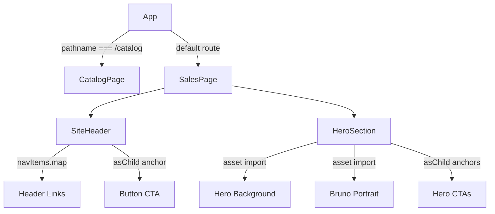

# First Section: Header + Hero — Planning Output (v1)

> **Status:** PLANNED — Awaiting approval  
> **Date:** 2026-06-09  
> **Scope:** `/` home route first viewport; keep `/catalog` route available  
> **Files:** 4 files planned (2 new, 2 modified)  
> **Risk:** 🟡 MEDIUM

---

## 1. Contexto

The project has a verified wireframe/component catalog and ready assets, but the home route still renders the Vite starter experience. The first development step should replace the starter home surface with the first real sales-page viewport: a compact header and hero section.

Verification completed:

- `docs/wireframe-asset-component-map.md` confirms shadcn primitives and hero/header assets are ready.
- `/catalog` already demonstrates component inventory, page map, hero layout, and design-system primitives.
- `npm run build` passes on 2026-06-09.

Assumption for this plan: "first section" means the first viewport, composed of Header + Hero, because the current page map lists `Header` first and `Hero` second.

Technical mapping:

- **Issue:** Home route is still starter content, not the sales-page first section.
- **Suspected Root Cause:** `src/App.tsx` has not yet been migrated from Vite scaffold UI into the planned landing-page composition.
- **Target Outcome:** `/` renders a branded header and hero using existing design-system primitives and approved assets; `/catalog` remains available.
- **Risks & Mitigation:** Replacing starter markup can affect global CSS and root layout. Mitigate by using a new scoped `sales-page` class, keeping `/catalog` branch intact, and validating build plus visual routes.

Risk classification:

```
Point #1: Build first home viewport
├── Risk Level: 🟡 MEDIUM
├── Blast Radius: / home route, global root layout, first-viewport CSS
├── Regression Surface: /catalog route styling, asset imports, responsive header/hero layout
└── Confidence: HIGH based on docs, catalog implementation, and successful build
```

---

## 2. Referência de Código Mapeada

### 2.1 Wireframe Readiness Source

[wireframe-asset-component-map.md](file:///Users/brunogovas/Projects/Projetos%20Solo/personal-sales-page/docs/wireframe-asset-component-map.md#L22-L32)

```md
| Component | File Location | Status | Later usage |
| --- | --- | --- | --- |
| Accordion | `components/ui/accordion.tsx` | Imported | Mobile issue index/disclosure pattern if the wireframe note is implemented |
| Aspect Ratio | `components/ui/aspect-ratio.tsx` | Imported | Image frames, portrait/collage slots, project previews |
| Badge | `components/ui/badge.tsx` | Imported | Technology pills, strategy tags, metadata labels |
| Button | `components/ui/button.tsx` | Imported | Hero CTA, portfolio links, closing CTA |
| Card | `components/ui/card.tsx` | Imported | Authority, proof, newsletter, portfolio cards |
| Carousel | `components/ui/carousel.tsx` | Imported | Technology/logo rail |
| Separator | `components/ui/separator.tsx` | Imported | Section rules, masthead dividers, card separators |
```

↑ Reuse `Button`, `Badge`, and `Separator` for first-section structure. Keep `Card`, `Carousel`, and `Accordion` for later sections.

### 2.2 Ready Header/Hero Assets

[wireframe-asset-component-map.md](file:///Users/brunogovas/Projects/Projetos%20Solo/personal-sales-page/docs/wireframe-asset-component-map.md#L34-L47)

```md
| Header logo | `src/assets/logo.webp` | Ready, converted from `src/assets/Component 1.png` | Website logo in the top-left of the future header |
| Hero background | `src/assets/hero-background.webp` | Ready, converted from `src/assets/Frame Inicial.png` | Hero section background |
| Footer background | `src/assets/footer-background.webp` | Ready, converted from `src/assets/Frame Final BG.png` | Footer background |
| Bruno portrait | `src/assets/bruno-portrait.webp` | Ready, converted from `src/assets/WhatsApp Image 2026-01-05 at 10.01.22.jpeg` | Bruno portrait/editorial image |
```

↑ Use `logo.webp`, `hero-background.webp`, and `bruno-portrait.webp` for the first viewport. Do not use missing company-logo assets in this pass.

### 2.3 Page Map: First Viewport Intent

[CatalogPage.tsx](file:///Users/brunogovas/Projects/Projetos%20Solo/personal-sales-page/src/CatalogPage.tsx#L158-L170)

```tsx
const pageSections = [
  {
    section: 'Header',
    intent: 'Logo, compact navigation, clear primary action',
    base: 'Button, logo asset',
    status: 'Ready asset',
  },
  {
    section: 'Hero',
    intent: 'Immediate positioning for personal sales and product-design work',
    base: 'Button, Badge, image background',
    status: 'Ready assets',
  },
```

↑ This is the canonical local source for what the first section should accomplish.

### 2.4 Existing Catalog Header Pattern

[CatalogPage.tsx](file:///Users/brunogovas/Projects/Projetos%20Solo/personal-sales-page/src/CatalogPage.tsx#L408-L421)

```tsx
<main className="catalog-page">
  <header className="catalog-topbar">
    <a className="brand-link" href="/" aria-label="Back to home">
      
      <span>Design System</span>
    </a>
    <nav aria-label="Catalog navigation">
      <a href="#components">Components</a>
      <a href="#assets">Assets</a>
      <a href="#decisions">Decisions</a>
    </nav>
  </header>
```

↑ Adapt this into `SiteHeader` with sales-page navigation labels and CTA. Keep semantic `header`, logo link, and `nav`.

### 2.5 Existing Catalog Hero Pattern

[CatalogPage.tsx](file:///Users/brunogovas/Projects/Projetos%20Solo/personal-sales-page/src/CatalogPage.tsx#L423-L481)

```tsx
<section className="catalog-hero">
  <div className="hero-copy">
    <Badge className="hero-badge">
      <Sparkles size={14} aria-hidden="true" />
      Source of truth
    </Badge>
    <h1>Catalog for every component and design choice.</h1>
    <p>
      A living reference for the personal sales page design system, component inventory,
      chosen tokens, approved assets, and implementation notes.
    </p>
    <div className="hero-actions">
      <Button asChild>
        <a href="#components">
          View components
          <ArrowUpRight size={16} aria-hidden="true" />
        </a>
      </Button>
      <Button asChild variant="outline">
        <a href="#decisions">Read rules</a>
      </Button>
    </div>
  </div>
```

↑ Reuse the pattern of badge, headline, paragraph, and paired CTA buttons, but switch copy and anchors to sales-page goals.

### 2.6 Current Home Route To Replace

[App.tsx](file:///Users/brunogovas/Projects/Projetos%20Solo/personal-sales-page/src/App.tsx#L1-L13)

```tsx
import { useState } from 'react'
import reactLogo from './assets/react.svg'
import viteLogo from './assets/vite.svg'
import heroImg from './assets/hero.png'
import CatalogPage from './CatalogPage'
import './App.css'

function App() {
  const [count, setCount] = useState(0)

  if (window.location.pathname === '/catalog') {
    return <CatalogPage />
  }
```

↑ Remove starter-only state and starter asset imports during implementation. Preserve the `/catalog` conditional.

### 2.7 Button Primitive API

[button.tsx](file:///Users/brunogovas/Projects/Projetos%20Solo/personal-sales-page/components/ui/button.tsx#L41-L62)

```tsx
function Button({
  className,
  variant = "default",
  size = "default",
  asChild = false,
  ...props
}: React.ComponentProps<"button"> &
  VariantProps<typeof buttonVariants> & {
    asChild?: boolean
  }) {
  const Comp = asChild ? Slot.Root : "button"

  return (
    <Comp
      data-slot="button"
      data-variant={variant}
      data-size={size}
      className={cn(buttonVariants({ variant, size, className }))}
      {...props}
    />
  )
}
```

↑ Use `Button asChild` for anchor CTAs instead of custom button styles.

---

## 3. Lógica de Implementação

### 3.1 Static Section Data

**Origem:** `[CRIADO]` + `[CONTEXT7]`

```tsx
const primaryNavItems = [
  { label: 'Work', href: '#work' },
  { label: 'Process', href: '#process' },
  { label: 'Proof', href: '#proof' },
]

const heroStats = [
  { value: 'UI', label: 'Product interfaces' },
  { value: 'LP', label: 'Sales pages' },
  { value: 'Ops', label: 'Automation systems' },
]
```

React documentation supports composing static UI from data and rendering repeated items with stable keys. This keeps the first section pure and avoids unnecessary state.

### 3.2 App Route Preservation

**Origem:** `[REPO EXISTENTE]` + `[CRIADO]`

```tsx
function App() {
  if (window.location.pathname === '/catalog') {
    return <CatalogPage />
  }

  return <SalesPage />
}
```

The existing `/catalog` branch remains in `App`. The starter counter state and Vite starter markup are removed.

### 3.3 Header Component

**Origem:** `[REPO EXISTENTE]` + `[CRIADO]`

```tsx
function SiteHeader() {
  return (
    <header className="site-header">
      <a className="site-brand" href="/" aria-label="Bruno Castelani home">
        
      </a>
      <nav className="site-nav" aria-label="Primary navigation">
        {primaryNavItems.map((item) => (
          <a key={item.href} href={item.href}>
            {item.label}
          </a>
        ))}
      </nav>
      <Button asChild size="sm" className="site-header-cta">
        <a href="#contact">Start a project</a>
      </Button>
    </header>
  )
}
```

Uses the mapped catalog header pattern and existing `Button` primitive.

### 3.4 Hero Component

**Origem:** `[REPO EXISTENTE]` + `[CRIADO]`

```tsx
function HeroSection() {
  return (
    <section className="sales-hero" aria-labelledby="hero-title">
      <div className="hero-background" aria-hidden="true" />
      <div className="sales-hero-copy">
        <Badge variant="outline" className="sales-hero-badge">
          Personal sales page
        </Badge>
        <h1 id="hero-title">Product design and sales systems that turn attention into action.</h1>
        <p>
          I design and build focused interfaces, funnels, and operational automations for teams
          that need more than a pretty page.
        </p>
        <div className="sales-hero-actions">
          <Button asChild size="lg">
            <a href="#work">See selected work</a>
          </Button>
          <Button asChild variant="outline" size="lg">
            <a href="#process">How I work</a>
          </Button>
        </div>
      </div>
      <figure className="sales-hero-portrait">
        
      </figure>
    </section>
  )
}
```

Hero follows the catalog hero composition: badge, headline, description, actions, and visual asset.

### 3.5 Sales Page Composition

**Origem:** `[CRIADO]`

```tsx
function SalesPage() {
  return (
    <main className="sales-page">
      <SiteHeader />
      <HeroSection />
    </main>
  )
}
```

Keeps the first iteration intentionally scoped to the first viewport only.

---

## 4. Arquitetura de Componentes



---

## 5. CSS/SCSS Reference

### 5.1 Catalog Root Isolation

[catalog.css](file:///Users/brunogovas/Projects/Projetos%20Solo/personal-sales-page/src/catalog.css#L1-L23)

```css
.catalog-page {
  --catalog-background: var(--background);
  --catalog-foreground: var(--foreground);
  --catalog-card: var(--card);
  --catalog-primary: var(--primary);
  --catalog-primary-foreground: var(--primary-foreground);
  --catalog-secondary: var(--secondary);
  --catalog-secondary-foreground: var(--secondary-foreground);
  --catalog-muted: var(--muted);
  --catalog-muted-foreground: var(--muted-foreground);
  --catalog-accent: var(--accent);
  --catalog-accent-foreground: var(--accent-foreground);
  --catalog-border: var(--border);
  --catalog-ring: var(--ring);
  --catalog-shadow: var(--shadow-md);

  min-height: 100svh;
  background: var(--catalog-background);
  color: var(--catalog-foreground);
  font-family: Inter, system-ui, -apple-system, BlinkMacSystemFont, "Segoe UI", sans-serif;
  letter-spacing: 0;
  text-align: left;
}
```

**Adaptações necessárias:**

| Propriedade | Valor Original | Novo Valor |
|-------------|---------------|------------|
| Scope class | `.catalog-page` | `.sales-page` |
| Token prefix | `--catalog-*` | `--sales-*` |
| Background | `var(--catalog-background)` | hero background image plus `var(--background)` fallback |

### 5.2 Catalog Header Layout

[catalog.css](file:///Users/brunogovas/Projects/Projetos%20Solo/personal-sales-page/src/catalog.css#L243-L283)

```css
.catalog-topbar {
  align-items: center;
  background: color-mix(in srgb, var(--catalog-card), transparent 15%);
  backdrop-filter: blur(12px);
  border-bottom: 1px solid var(--catalog-border);
  display: flex;
  gap: 1.25rem;
  justify-content: space-between;
  min-height: 5rem;
  padding: 1rem clamp(1.25rem, 4vw, 4rem);
  position: sticky;
  top: 0;
  z-index: 10;
}
```

**Adaptações necessárias:**

| Propriedade | Valor Original | Novo Valor |
|-------------|---------------|------------|
| Position | `sticky` | `fixed` or `sticky`, validate against hero image readability |
| Class | `.catalog-topbar` | `.site-header` |
| CTA | nav only | nav + `Button asChild` CTA |

### 5.3 Catalog Hero Layout

[catalog.css](file:///Users/brunogovas/Projects/Projetos%20Solo/personal-sales-page/src/catalog.css#L285-L320)

```css
.catalog-hero {
  display: grid;
  gap: 2rem;
  grid-template-columns: minmax(0, 1.2fr) minmax(320px, 0.8fr);
  margin: 0 auto;
  max-width: 1180px;
  padding: clamp(3.5rem, 8vw, 7rem) clamp(1.25rem, 4vw, 2rem) 4rem;
}

.hero-copy {
  align-self: center;
  display: grid;
  gap: 1.35rem;
}
```

**Adaptações necessárias:**

| Propriedade | Valor Original | Novo Valor |
|-------------|---------------|------------|
| Grid columns | text + panel | text + portrait/background visual |
| Padding | section-only spacing | first viewport spacing accounting for header |
| Max width | `1180px` | keep unless wireframe requires wider artboard |

---

## 6. Novos Componentes

### 6.1 SiteHeader

**Path:** `/Users/brunogovas/Projects/Projetos Solo/personal-sales-page/src/App.tsx` initially; extract later only if repetition appears.

#### Props

```tsx
{}
```

#### Lógica Core

```tsx
function SiteHeader() {
  return (
    <header className="site-header">
      <a className="site-brand" href="/" aria-label="Bruno Castelani home">
        
      </a>
      <nav className="site-nav" aria-label="Primary navigation">
        {primaryNavItems.map((item) => (
          <a key={item.href} href={item.href}>
            {item.label}
          </a>
        ))}
      </nav>
      <Button asChild size="sm" className="site-header-cta">
        <a href="#contact">Start a project</a>
      </Button>
    </header>
  )
}
```

### 6.2 HeroSection

**Path:** `/Users/brunogovas/Projects/Projetos Solo/personal-sales-page/src/App.tsx` initially; extract later only when later sections make `App.tsx` too large.

#### Props

```tsx
{}
```

#### Lógica Core

```tsx
function HeroSection() {
  return (
    <section className="sales-hero" aria-labelledby="hero-title">
      <div className="sales-hero-copy">
        <Badge variant="outline" className="sales-hero-badge">
          Personal sales page
        </Badge>
        <h1 id="hero-title">Product design and sales systems that turn attention into action.</h1>
        <p>
          I design and build focused interfaces, funnels, and operational automations for teams
          that need more than a pretty page.
        </p>
        <div className="sales-hero-actions">
          <Button asChild size="lg">
            <a href="#work">See selected work</a>
          </Button>
          <Button asChild variant="outline" size="lg">
            <a href="#process">How I work</a>
          </Button>
        </div>
      </div>
      <figure className="sales-hero-portrait">
        
      </figure>
    </section>
  )
}
```

---

## 7. Componentes Modificados

### 7.1 App.tsx

**Remove starter state/imports:**

```tsx
- import { useState } from 'react'
- import reactLogo from './assets/react.svg'
- import viteLogo from './assets/vite.svg'
- import heroImg from './assets/hero.png'
```

**Add real assets and primitives:**

```tsx
import { ArrowUpRight } from 'lucide-react'
import logo from './assets/logo.webp'
import heroBackground from './assets/hero-background.webp'
import brunoPortrait from './assets/bruno-portrait.webp'
import { Badge } from '@/components/ui/badge'
import { Button } from '@/components/ui/button'
```

**Preserve route logic:**

```tsx
function App() {
  if (window.location.pathname === '/catalog') {
    return <CatalogPage />
  }

  return <SalesPage />
}
```

### 7.2 App.css

**Replace starter styles with scoped first-section styles:**

```css
.sales-page {
  min-height: 100svh;
  background: var(--background);
  color: var(--foreground);
  text-align: left;
}

.site-header {
  align-items: center;
  display: flex;
  justify-content: space-between;
  min-height: 5rem;
  padding: 1rem clamp(1.25rem, 4vw, 4rem);
}

.sales-hero {
  display: grid;
  grid-template-columns: minmax(0, 1.1fr) minmax(280px, 0.9fr);
  min-height: calc(100svh - 5rem);
}
```

---

## 8. i18n Keys (se aplicável)

Not applicable. The current project has no i18n layer.

### 8.1 Plano de Verificação Anti-Reversão

```bash
rg -n "CatalogPage|window.location.pathname === '/catalog'" src/App.tsx
rg -n "components/ui/(button|badge)" src/App.tsx
```

---

## 9. Files Summary

| Action | File | Risk |
|--------|------|------|
| **NEW** | `/Users/brunogovas/Projects/Projetos Solo/personal-sales-page/docs/sessions/2026-06/2026-06-09-first-section-planning.md` | 🟢 LOW |
| **MODIFY** | `/Users/brunogovas/Projects/Projetos Solo/personal-sales-page/src/App.tsx` | 🟡 MEDIUM |
| **MODIFY** | `/Users/brunogovas/Projects/Projetos Solo/personal-sales-page/src/App.css` | 🟡 MEDIUM |
| **OPTIONAL NEW** | `/Users/brunogovas/Projects/Projetos Solo/personal-sales-page/docs/sessions/2026-06/2026-06-09-first-section-handoff.md` | 🟢 LOW |

---

## 10. Implementation Order

1. **Phase A:** Confirm stakeholder approval for Header + Hero as the first viewport scope.
2. **Phase B:** Update `src/App.tsx` to preserve `/catalog`, remove starter state, and compose `SalesPage`, `SiteHeader`, and `HeroSection`.
3. **Phase C:** Replace starter `src/App.css` rules with scoped `.sales-page`, `.site-header`, and `.sales-hero` styles.
4. **Phase D:** Run `npm run build`.
5. **Phase E:** Start local dev server and visually verify `/` and `/catalog` desktop/mobile.
6. **Phase F:** Commit the approved implementation and create session handoff.

---

## 11. Rollback Plan

```
Componentes modificados:
├── Git Ref: HEAD before implementation approval
├── Revert: git checkout <ref> -- src/App.tsx src/App.css
└── Validação: npm run build, then verify /catalog still renders
```

No destructive command should be run. If rollback is needed, use non-destructive `git restore --source=<ref> -- src/App.tsx src/App.css` only after explicit approval.

---

## 12. Verification Plan

| # | Test Case | Route | Expected |
|---|-----------|-------|----------|
| 1 | Build validation | n/a | `npm run build` passes |
| 2 | Home first viewport | `/` | Header logo/nav/CTA render; hero headline, copy, CTAs, and portrait/background render |
| 3 | Catalog regression | `/catalog` | Existing catalog page still renders and keeps component inventory |
| 4 | Mobile header | `/` at 390px width | Header content wraps or compresses without overlap |
| 5 | Mobile hero | `/` at 390px width | Hero copy and image stack cleanly; CTAs remain tappable |
| 6 | Console check | `/` and `/catalog` | No new console errors or missing asset errors |

---

## 13. Handoff (se aplicável)

No external integration is required for this first section.

Post-implementation session handoff should be created at:

`/Users/brunogovas/Projects/Projetos Solo/personal-sales-page/docs/sessions/2026-06/2026-06-09-first-section-handoff.md`
