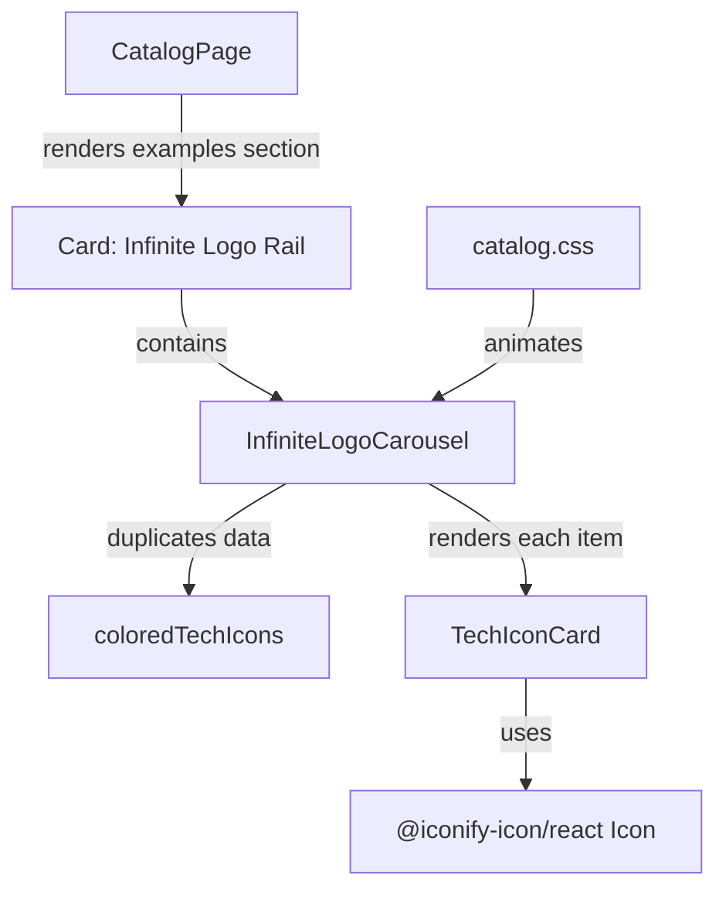

# Infinite Logo Carousel — Planning Output (v1)

> **Status:** PLANEJADO — Aguardando aprovação  
> **Data:** 2026-06-09  
> **Scope:** `/catalog`  
> **Files:** 2 arquivos (0 novos, 2 modificados)  
> **Risk:** 🟡 MEDIUM

---

## 1. Contexto

The catalog page currently includes a finite Embla/shadcn `Carousel` preview for the technology logos. The requested adjustment is to add an infinite horizontal carousel effect using the current logo inventory, adapting the pasted CSS-only reference to this Vite/React codebase.

The implementation should reuse the current `coloredTechIcons` data and `TechIconCard` rendering pattern, add a local `InfiniteLogoCarousel` component to `CatalogPage.tsx`, and add scoped CSS in `catalog.css`. No new library is required because the effect can be done with duplicated rendered items plus a CSS transform animation.

Context7 validation:

- React docs confirm list rendering should use `map()` and stable keys based on the data. For duplicated visual rows, keys will combine a duplicate group label with `tech.name`.
- Tailwind CSS docs confirm utility classes can coexist with custom CSS; keyframes/animation can live in scoped CSS. Existing project patterns already mix utility classes in JSX with `catalog.css`.
- Iconify docs confirm the current import and usage shape: `import { Icon } from '@iconify-icon/react'`, with `icon`, `width`, and `height` props.

Point #1: Add infinite logo carousel to catalog
├── Risk Level: 🟡 MEDIUM
├── Blast Radius: `/catalog`, specifically the examples/technology logo section
├── Regression Surface: current finite carousel preview, logo rendering, mobile layout, animation accessibility
└── Confidence: HIGH based on audit completeness

---

## 2. Referência de Código Mapeada

### 2.1 Current Logo Inventory

[CatalogPage.tsx L258-L274](file:///Users/brunogovas/Projects/Projetos%20Solo/personal-sales-page/src/CatalogPage.tsx#L258-L274)

```tsx
const coloredTechIcons = [
  { name: 'JavaScript', icon: 'logos:javascript' },
  { name: 'TypeScript', icon: 'logos:typescript-icon' },
  { name: 'React', icon: 'logos:react' },
  { name: 'Node.js', icon: 'logos:nodejs-icon' },
  { name: 'HTML5', icon: 'logos:html-5' },
  { name: 'CSS3', icon: 'logos:css-3' },
  { name: 'PostgreSQL', icon: 'logos:postgresql' },
  { name: 'Docker', icon: 'logos:docker-icon' },
  { name: 'Tailwind CSS', icon: 'logos:tailwindcss-icon' },
  { name: 'Vite', icon: 'logos:vitejs' },
  { name: 'Supabase', icon: 'logos:supabase-icon' },
  { name: 'Prisma', icon: 'logos:prisma' },
  { name: 'n8n', icon: 'simple-icons:n8n', isMonochrome: true },
  { name: 'Stripe', icon: 'logos:stripe' },
  { name: 'Cloudflare', icon: 'logos:cloudflare-icon' },
]
```

↑ Reuse this exact source of truth so the infinite carousel uses the current logos.

### 2.2 Current Logo Card Renderer

[CatalogPage.tsx L356-L364](file:///Users/brunogovas/Projects/Projetos%20Solo/personal-sales-page/src/CatalogPage.tsx#L356-L364)

```tsx
function TechIconCard({ name, icon, isMonochrome }: (typeof coloredTechIcons)[number]) {
  return (
    <div className={`tech-icon-card ${isMonochrome ? 'is-monochrome' : ''}`}>
      <span className="tech-icon-mark">
        <Icon icon={icon} width="36" height="36" aria-label={name} />
      </span>
      <span>{name}</span>
    </div>
  )
}
```

↑ Reuse this component so Iconify rendering, monochrome n8n treatment, and label structure stay consistent.

### 2.3 Current Finite Carousel Preview

[CatalogPage.tsx L644-L663](file:///Users/brunogovas/Projects/Projetos%20Solo/personal-sales-page/src/CatalogPage.tsx#L644-L663)

```tsx
<Card>
  <CardHeader>
    <CardTitle>Gallery Rail</CardTitle>
    <CardDescription>Colored tech logos from the documented Iconify set.</CardDescription>
  </CardHeader>
  <CardContent className="px-12 pb-6">
    <Carousel className="tech-carousel">
      <CarouselContent>
        {coloredTechIcons.map((tech) => (
          <CarouselItem key={tech.name}>
            <div className="p-1">
              <TechIconCard {...tech} />
            </div>
          </CarouselItem>
        ))}
      </CarouselContent>
      <CarouselPrevious />
      <CarouselNext />
    </Carousel>
  </CardContent>
</Card>
```

↑ Replace this preview body with the new infinite carousel component while keeping the `Card`, `CardHeader`, and catalog section placement.

### 2.4 Current Tech Card CSS

[catalog.css L578-L620](file:///Users/brunogovas/Projects/Projetos%20Solo/personal-sales-page/src/catalog.css#L578-L620)

```css
.tech-carousel {
  max-width: 22rem;
  width: 100%;
}

.tech-icon-card {
  align-items: center;
  aspect-ratio: 1;
  background: var(--catalog-muted);
  border: 1px solid var(--catalog-border);
  border-radius: 8px;
  display: grid;
  gap: 0.75rem;
  justify-items: center;
  min-height: 9rem;
  padding: 1.25rem;
  text-align: center;
}

.tech-icon-mark {
  align-items: center;
  display: inline-flex;
  justify-content: center;
}

.tech-icon-card.is-monochrome .tech-icon-mark {
  background: #ea4b71;
  border-radius: 8px;
  color: #ffffff;
  height: 3.5rem;
  width: 3.5rem;
}

.tech-icon-card span {
  color: var(--catalog-foreground);
  font-size: 0.9rem;
  font-weight: 800;
  line-height: 1.25;
}

.tech-icon-card.is-monochrome .tech-icon-mark iconify-icon {
  color: #ffffff;
}
```

↑ Extend this CSS rather than creating a separate styling system. The existing `tech-icon-card` remains the base visual for each item.

### 2.5 Current Responsive Breakpoints

[catalog.css L678-L739](file:///Users/brunogovas/Projects/Projetos%20Solo/personal-sales-page/src/catalog.css#L678-L739)

```css
@media (max-width: 1040px) {
  .catalog-hero,
  .swatch-grid,
  .asset-grid,
  .example-grid {
    grid-template-columns: 1fr 1fr;
  }

  .section-map {
    grid-template-columns: repeat(2, minmax(0, 1fr));
  }

  .inventory-row {
    grid-template-columns: 1fr;
  }

  .inventory-row [data-slot="badge"] {
    justify-self: start;
  }

  .rules-grid {
    grid-template-columns: 1fr 1fr;
  }
}

@media (max-width: 720px) {
  .catalog-topbar {
    align-items: flex-start;
    flex-direction: column;
    position: static;
  }

  .catalog-topbar nav {
    justify-content: flex-start;
  }

  .catalog-hero,
  .swatch-grid,
  .asset-grid,
  .example-grid,
  .section-map,
  .rules-grid {
    grid-template-columns: 1fr;
  }

  .hero-copy h1 {
    font-size: 2.8rem;
  }

  .metric-grid {
    grid-template-columns: 1fr;
  }

  .proof-strip {
    align-items: flex-start;
    flex-direction: column;
  }

  .catalog-section {
    padding-block: 3rem;
  }
}
```

↑ Add marquee responsive adjustments inside these existing breakpoints to keep the CSS structure coherent.

---

## 3. Lógica de Implementação

### 3.1 Duplicate Logo Data for Seamless Loop

**Origem:** `[CONTEXT7]` + `[CRIADO]`

```tsx
function InfiniteLogoCarousel() {
  const duplicatedLogos = [
    { group: 'a', items: coloredTechIcons },
    { group: 'b', items: coloredTechIcons },
  ]

  return (
    <div className="logo-marquee" aria-label="Technology logo carousel">
      <div className="logo-marquee-track">
        {duplicatedLogos.flatMap(({ group, items }) =>
          items.map((tech) => (
            <div className="logo-marquee-item" key={`${group}-${tech.name}`} aria-hidden={group === 'b'}>
              <TechIconCard {...tech} />
            </div>
          )),
        )}
      </div>
    </div>
  )
}
```

Flow: React renders two copies of the same logo set. The second copy is hidden from assistive technology because it is only visual duplication. Stable keys combine the duplicate group and logo name.

### 3.2 Replace Finite Gallery Body in Catalog Card

**Origem:** `[REPO EXISTENTE]` + `[CRIADO]`

```tsx
<Card>
  <CardHeader>
    <CardTitle>Infinite Logo Rail</CardTitle>
    <CardDescription>Current technology logos in a CSS-only continuous loop.</CardDescription>
  </CardHeader>
  <CardContent className="pb-6">
    <InfiniteLogoCarousel />
  </CardContent>
</Card>
```

Flow: Keep the existing catalog `Card` structure but swap the Embla preview for the CSS-only component. The existing shadcn-style `Carousel` import can be retained if still used elsewhere in the page; if not used after the swap, remove only the unused carousel import to satisfy lint.

### 3.3 Scoped Infinite Marquee CSS

**Origem:** `[CRIADO]` + pasted reference adaptation

```css
.logo-marquee {
  overflow: hidden;
  width: 100%;
  mask-image: linear-gradient(to right, transparent, #000 8%, #000 92%, transparent);
}

.logo-marquee-track {
  display: flex;
  gap: 1rem;
  width: max-content;
  animation: logo-marquee-scroll 34s linear infinite;
  will-change: transform;
}

.logo-marquee:hover .logo-marquee-track {
  animation-play-state: paused;
}

.logo-marquee-item {
  flex: 0 0 9rem;
}

.logo-marquee:hover .tech-icon-card {
  filter: grayscale(100%);
}

.logo-marquee .logo-marquee-item:hover .tech-icon-card {
  filter: grayscale(0%);
  transform: translateY(-2px) scale(1.02);
}

@keyframes logo-marquee-scroll {
  from {
    transform: translateX(0);
  }

  to {
    transform: translateX(-50%);
  }
}
```

Flow: The track width is content-based, the duplicated item set makes `translateX(-50%)` loop cleanly, and hover pauses the animation while emphasizing the hovered card.

### 3.4 Reduced Motion and Responsive Adjustments

**Origem:** `[CONTEXT7]` + `[CRIADO]`

```css
@media (prefers-reduced-motion: reduce) {
  .logo-marquee-track {
    animation: none;
    flex-wrap: wrap;
    width: 100%;
  }
}

@media (max-width: 1040px) {
  .logo-marquee-item {
    flex-basis: 8rem;
  }
}

@media (max-width: 720px) {
  .logo-marquee {
    mask-image: linear-gradient(to right, transparent, #000 5%, #000 95%, transparent);
  }

  .logo-marquee-track {
    animation-duration: 40s;
    gap: 0.75rem;
  }

  .logo-marquee-item {
    flex-basis: 7rem;
  }
}
```

Flow: Reduced-motion users get a static wrapped logo set. Smaller screens receive narrower cards and slower movement, following the pasted reference and existing project breakpoints.

---

## 4. Arquitetura de Componentes



---

## 5. CSS/SCSS Reference

### 5.1 Existing Technology Card Pattern

[catalog.css L583-L595](file:///Users/brunogovas/Projects/Projetos%20Solo/personal-sales-page/src/catalog.css#L583-L595)

```css
.tech-icon-card {
  align-items: center;
  aspect-ratio: 1;
  background: var(--catalog-muted);
  border: 1px solid var(--catalog-border);
  border-radius: 8px;
  display: grid;
  gap: 0.75rem;
  justify-items: center;
  min-height: 9rem;
  padding: 1.25rem;
  text-align: center;
}
```

**Adaptações necessárias:**

| Propriedade | Valor Original | Novo Valor |
|-------------|---------------|------------|
| `transition` | absent | add `transform 180ms ease, filter 180ms ease` to `.tech-icon-card` |
| `min-height` | `9rem` | keep for desktop, optionally reduce inside mobile breakpoint |
| `border-radius` | `8px` | keep, aligned with design rule |

### 5.2 Existing Responsive Pattern

[catalog.css L678-L739](file:///Users/brunogovas/Projects/Projetos%20Solo/personal-sales-page/src/catalog.css#L678-L739)

```css
@media (max-width: 1040px) {
  .catalog-hero,
  .swatch-grid,
  .asset-grid,
  .example-grid {
    grid-template-columns: 1fr 1fr;
  }
}

@media (max-width: 720px) {
  .catalog-hero,
  .swatch-grid,
  .asset-grid,
  .example-grid,
  .section-map,
  .rules-grid {
    grid-template-columns: 1fr;
  }
}
```

**Adaptações necessárias:**

| Propriedade | Valor Original | Novo Valor |
|-------------|---------------|------------|
| `@media (max-width: 1040px)` | layout grids only | add `.logo-marquee-item { flex-basis: 8rem; }` |
| `@media (max-width: 720px)` | mobile layout only | add smaller logo item, mask, and slower duration |

---

## 6. Novos Componentes

### 6.1 InfiniteLogoCarousel

**Path:** `src/CatalogPage.tsx`

#### Props

```tsx
{}
```

#### Lógica Core

```tsx
function InfiniteLogoCarousel() {
  const duplicatedLogos = [
    { group: 'a', items: coloredTechIcons },
    { group: 'b', items: coloredTechIcons },
  ]

  return (
    <div className="logo-marquee" aria-label="Technology logo carousel">
      <div className="logo-marquee-track">
        {duplicatedLogos.flatMap(({ group, items }) =>
          items.map((tech) => (
            <div className="logo-marquee-item" key={`${group}-${tech.name}`} aria-hidden={group === 'b'}>
              <TechIconCard {...tech} />
            </div>
          )),
        )}
      </div>
    </div>
  )
}
```

---

## 7. Componentes Modificados

### 7.1 CatalogPage.tsx

**Novos states/hooks:**

```ts
// None. The carousel is CSS-only and does not need useState/useEffect.
```

**Modificações no código existente:**

```tsx
// Add after TechIconCard
function InfiniteLogoCarousel() {
  const duplicatedLogos = [
    { group: 'a', items: coloredTechIcons },
    { group: 'b', items: coloredTechIcons },
  ]

  return (
    <div className="logo-marquee" aria-label="Technology logo carousel">
      <div className="logo-marquee-track">
        {duplicatedLogos.flatMap(({ group, items }) =>
          items.map((tech) => (
            <div className="logo-marquee-item" key={`${group}-${tech.name}`} aria-hidden={group === 'b'}>
              <TechIconCard {...tech} />
            </div>
          )),
        )}
      </div>
    </div>
  )
}
```

```tsx
// Replace the current Gallery Rail card body
<Card>
  <CardHeader>
    <CardTitle>Infinite Logo Rail</CardTitle>
    <CardDescription>Current technology logos in a CSS-only continuous loop.</CardDescription>
  </CardHeader>
  <CardContent className="pb-6">
    <InfiniteLogoCarousel />
  </CardContent>
</Card>
```

**Props adicionais para sub-componentes:**

```tsx
// None.
```

### 7.2 catalog.css

**Modificações no código existente:**

```css
.tech-icon-card {
  transition:
    filter 180ms ease,
    transform 180ms ease;
}

.logo-marquee {
  overflow: hidden;
  width: 100%;
  mask-image: linear-gradient(to right, transparent, #000 8%, #000 92%, transparent);
}

.logo-marquee-track {
  display: flex;
  gap: 1rem;
  width: max-content;
  animation: logo-marquee-scroll 34s linear infinite;
  will-change: transform;
}

.logo-marquee:hover .logo-marquee-track {
  animation-play-state: paused;
}

.logo-marquee-item {
  flex: 0 0 9rem;
}

.logo-marquee:hover .tech-icon-card {
  filter: grayscale(100%);
}

.logo-marquee .logo-marquee-item:hover .tech-icon-card {
  filter: grayscale(0%);
  transform: translateY(-2px) scale(1.02);
}

@keyframes logo-marquee-scroll {
  from {
    transform: translateX(0);
  }

  to {
    transform: translateX(-50%);
  }
}
```

---

## 8. i18n Keys (se aplicável)

### 8.1 Novas Chaves

```json
{}
```

### 8.2 Plano de Verificação Anti-Reversão

```bash
# Not applicable: this project has no i18n files in the audited surface.
```

---

## 9. Files Summary

| Action | File | Risk |
|--------|------|------|
| **MODIFY** | `/Users/brunogovas/Projects/Projetos Solo/personal-sales-page/src/CatalogPage.tsx` | 🟡 MEDIUM |
| **MODIFY** | `/Users/brunogovas/Projects/Projetos Solo/personal-sales-page/src/catalog.css` | 🟡 MEDIUM |

---

## 10. Implementation Order

1. **Phase A:** Add `InfiniteLogoCarousel` below `TechIconCard` in `CatalogPage.tsx`.
2. **Phase B:** Replace the finite `Gallery Rail` preview card body with `InfiniteLogoCarousel`.
3. **Phase C:** Remove unused shadcn carousel imports only if lint reports they are unused after the replacement.
4. **Phase D:** Add scoped marquee CSS, animation keyframes, reduced-motion handling, and responsive adjustments to `catalog.css`.
5. **Phase E:** Run validation gates before any additional task.

---

## 11. Rollback Plan

```
Componentes modificados:
├── Git Ref: HEAD antes da implementação
├── Revert: git checkout <ref> -- src/CatalogPage.tsx src/catalog.css
└── Validação: npm run lint && npm run build, then visually confirm /catalog returns to the previous Gallery Rail card
```

Point #1 Rollback:
├── Git Reference: current HEAD before implementation
├── Files to Revert: `src/CatalogPage.tsx`, `src/catalog.css`
├── Revert Command: `git checkout <ref> -- src/CatalogPage.tsx src/catalog.css`
└── Post-Revert Validation: `/catalog` loads, finite Gallery Rail still renders, no console errors

---

## 12. Verification Plan

| # | Test Case | Route | Expected |
|---|-----------|-------|----------|
| 1 | Lint check | N/A | `npm run lint` passes or reports only pre-existing unrelated warnings |
| 2 | Build check | N/A | `npm run build` passes |
| 3 | Desktop visual check | `/catalog` | Infinite logo row scrolls smoothly, loops without a visible blank gap, and uses current logos |
| 4 | Hover check | `/catalog` | Track pauses on hover; hovered logo returns to color and receives subtle transform |
| 5 | Mobile check | `/catalog` at <=720px | Logo cards fit without text overlap or horizontal page overflow |
| 6 | Reduced motion check | System/browser reduced motion | Track does not animate and logos remain visible |
| 7 | Console check | `/catalog` | No new runtime errors or warnings |

---

## 13. Handoff (se aplicável)

### 13.1 Session Handoff

- **O que é necessário:** After approval and implementation, create a final handoff document in `docs/sessions/2026-06/` summarizing changed files, verification results, and any remaining risks.
- **Documento de handoff:** `docs/sessions/2026-06/2026-06-09-infinite-logo-carousel.md`
