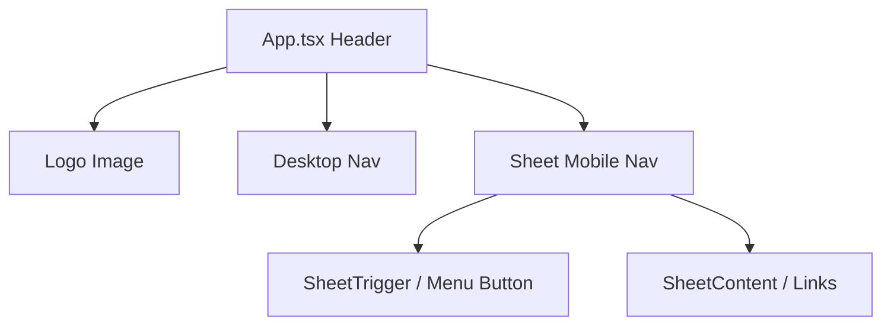

# Header Adjustments — Planning Output (v1)

> **Status:** PLANEJADO — Aguardando aprovação  
> **Data:** 2026-06-09
> **Scope:** `[App.tsx (Header)]`  
> **Files:** 2 arquivos (0 novos, 2 modificados)  
> **Risk:** 🟡 MEDIUM

---

## 1. Contexto

O objetivo é ajustar o header da landing page (`App.tsx`):
- Substituir o texto "Bruno Castelani Product Developer..." pelo logotipo oficial (`logo.webp`).
- Remover a linha inferior do header (borda), mantendo-o transparente.
- Tornar o header `sticky` no topo da tela.
- Implementar um menu hambúrguer para dispositivos móveis usando o componente `Sheet` do Shadcn UI.

---

## 2. Referência de Código Mapeada

### 2.1 Código do Header Existente

[App.tsx L17-L34](file:///Users/brunogovas/Projects/Projetos%20Solo/personal-sales-page/src/App.tsx#L17-L34)

```tsx
  return (
    <header className="site-header">
      <a className="site-brand" href="/" aria-label="Bruno Castelani home">
        <span>
          <strong>BRUNO CASTELANI</strong>
          <small>Product Developer / Marketing Automation</small>
        </span>
      </a>

      <nav className="site-nav" aria-label="Primary navigation">
        {navItems.map((item) => (
          <a key={item.href} href={item.href}>
            {item.label}
          </a>
        ))}
      </nav>
    </header>
  )
```

### 2.2 Estilo do Header Existente

[App.css L22-L32](file:///Users/brunogovas/Projects/Projetos%20Solo/personal-sales-page/src/App.css#L22-L32)

```css
.site-header {
  position: relative;
  z-index: 2;
  display: flex;
  align-items: center;
  justify-content: space-between;
  height: 96px;
  padding-inline: clamp(24px, 6.67vw, 96px);
  background: transparent;
  border-bottom: 1px solid rgba(230, 236, 242, 0.65);
}
```

---

## 3. Lógica de Implementação

### 3.1 Substituição pelo Logo

**Origem:** `[CRIADO]`

```tsx
import logo from './assets/logo.webp'

// ...

<a className="site-brand" href="/" aria-label="Bruno Castelani home">
  
</a>
```

### 3.2 Menu Hamburguer (Mobile)

**Origem:** `[REPO EXISTENTE]` (Sheet Shadcn) + `[CRIADO]`

```tsx
import { Menu } from 'lucide-react'
import { Sheet, SheetContent, SheetTrigger } from './components/ui/sheet'
import { Button } from './components/ui/button'

// ...

<header className="site-header">
  <a className="site-brand" href="/" aria-label="Bruno Castelani home">
    
  </a>

  {/* Desktop Nav */}
  <nav className="site-nav hidden md:flex" aria-label="Primary navigation">
    {navItems.map((item) => (
      <a key={item.href} href={item.href}>
        {item.label}
      </a>
    ))}
  </nav>

  {/* Mobile Nav */}
  <div className="md:hidden flex items-center">
    <Sheet>
      <SheetTrigger asChild>
        <Button variant="ghost" size="icon" aria-label="Open Menu">
          <Menu className="h-6 w-6" />
        </Button>
      </SheetTrigger>
      <SheetContent side="right">
        <nav className="flex flex-col gap-4 mt-8" aria-label="Mobile navigation">
          {navItems.map((item) => (
            <a key={item.href} href={item.href} className="text-lg font-medium text-slate-800 uppercase tracking-widest hover:text-slate-500 transition-colors">
              {item.label}
            </a>
          ))}
        </nav>
      </SheetContent>
    </Sheet>
  </div>
</header>
```

---

## 4. Arquitetura de Componentes



---

## 5. CSS/SCSS Reference

### 5.1 Ajuste do Header (Sticky & Borda)

[App.css L22-L32](file:///Users/brunogovas/Projects/Projetos%20Solo/personal-sales-page/src/App.css#L22-L32)

```css
.site-header {
  position: relative;
  z-index: 50; /* Aumentado para o sticky ficar acima de tudo */
  display: flex;
  align-items: center;
  justify-content: space-between;
  height: 96px;
  padding-inline: clamp(24px, 6.67vw, 96px);
  background: transparent;
  /* border-bottom removido */
}
```

**Adaptações necessárias:**

| Propriedade | Valor Original | Novo Valor |
|-------------|---------------|------------|
| `position` | `relative` | `sticky` |
| `top` | `(não definido)` | `0` |
| `border-bottom` | `1px solid rgba(230, 236, 242, 0.65)` | `none` |
| `z-index` | `2` | `50` |

---

## 6. Novos Componentes

Não há necessidade de criar novos componentes (já vamos utilizar o `Sheet` e `Button` do shadcn presentes em `components/ui`).

---

## 7. Componentes Modificados

### 7.1 src/App.tsx

**Modificações no código existente:**
Importaremos `logo`, `Menu`, `Sheet`, `SheetContent`, e `SheetTrigger`. A navegação será dividida em uma versão desktop (`hidden md:flex`) e uma versão mobile usando o componente `Sheet`.

### 7.2 src/App.css

**Modificações no código existente:**
Alteração da classe `.site-header` para torná-la `sticky`, remover a borda e ajustar o `z-index`. Será necessário garantir que a tag `nav.site-nav` seja oculta no mobile por meio de `display: none;` na media query, se não usarmos Tailwind classes. 

Como o tailwind está instalado, podemos substituir o `.site-nav` por classes no Tailwind ou adicionar na `@media (max-width: 900px)` um `display: none;` para o `site-nav` antigo.

---

## 8. i18n Keys (se aplicável)

N/A

---

## 9. Files Summary

| Action | File | Risk |
|--------|------|------|
| **MODIFY** | `/src/App.tsx` | 🟡 MEDIUM |
| **MODIFY** | `/src/App.css` | 🟢 LOW |

---

## 10. Implementation Order

1. **Phase A:** Atualizar `App.css` para ajustar o `.site-header` (tornar sticky, remover borda, z-index) e ocultar `.site-nav` tradicional em mobile.
2. **Phase B:** Atualizar `App.tsx` para usar o Logo, adicionando `logo.webp`.
3. **Phase C:** Adicionar o componente `Sheet` com as lógicas para mobile em `App.tsx`.
4. **Phase D:** Validar visualmente o sticky, a transparência e a responsividade do menu.

---

## 11. Rollback Plan

```
Componentes modificados:
├── Git Ref: HEAD atual antes da implementação
├── Revert: git checkout HEAD -- src/App.tsx src/App.css
└── Validação: Verificar se o header antigo com o texto "Bruno Castelani" retorna.
```

---

## 12. Verification Plan

| # | Test Case | Route | Expected |
|---|-----------|-------|----------|
| 1 | Logo Visual | `/` | O logo da empresa deve ser renderizado no lugar do texto |
| 2 | Sticky Header | `/` | O header deve acompanhar o scroll mantendo fundo transparente e sem borda separadora |
| 3 | Desktop Nav | `/` (Viewport largo) | O menu horizontal deve ser exibido, o hamburger deve ser invisível |
| 4 | Mobile Nav | `/` (Viewport estreito) | O menu horizontal some, o ícone hamburger aparece. Ao clicar, o `Sheet` abre com links funcionais |

---

## 13. Handoff

N/A
