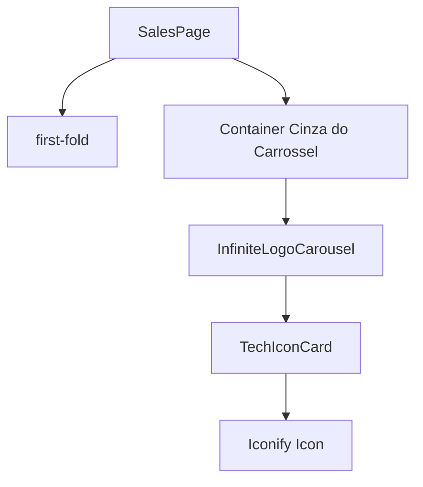

# Carousel Component — Planning Output (v2)

> **Status:** PLANEJADO — Aguardando aprovação  
> **Data:** 2026-06-09  
> **Scope:** `[App.tsx (Landing Page)]`  
> **Files:** 3 arquivos (1 novo, 2 modificados)  
> **Risk:** 🟡 MEDIUM

---

## 1. Contexto

O objetivo é desenvolver e posicionar o componente de carrossel infinito de logotipos de tecnologias na Landing Page. 
- O componente de carrossel infinito e os ícones já existem no `CatalogPage.tsx` e no `catalog.css`.
- A ideia principal é que seja tratado como um **novo componente** (com algum espaçamento - `padding`), e não como uma nova seção enorme da página.
- A cor de fundo será um fundo cinza suave (como o usado nos cards ou seções secundárias do catálogo), sem utilizar a imagem `Frame Inicial.png`.
- Como o componente já existe no catálogo, vamos abstraí-lo para reutilização na Landing Page sem duplicar código.

---

## 2. Referência de Código Mapeada

### 2.1 Componente do Catálogo: InfiniteLogoCarousel

[CatalogPage.tsx L372-L406](file:///Users/brunogovas/Projects/Projetos%20Solo/personal-sales-page/src/CatalogPage.tsx#L372-L406)

```tsx
function InfiniteLogoCarousel() {
  const duplicatedLogos = [
    { group: 'a', items: coloredTechIcons },
    { group: 'b', items: coloredTechIcons },
  ]

  return (
    <div className="logo-marquee" aria-label="Technology logo carousel">
      <div className="logo-marquee-preload" aria-hidden="true">
        {coloredTechIcons.map((tech) => (
          <Icon
            key={tech.name}
            icon={tech.icon}
            width="1"
            height="1"
            style={tech.brandColor ? { color: tech.brandColor } : undefined}
          />
        ))}
      </div>
      <div className="logo-marquee-track">
        {duplicatedLogos.flatMap(({ group, items }) =>
          items.map((tech) => (
            <div
              className="logo-marquee-item"
              key={`${group}-${tech.name}`}
              aria-hidden={group === 'b'}
            >
              <TechIconCard {...tech} />
            </div>
          )),
        )}
      </div>
    </div>
  )
}
```

---

## 3. Lógica de Implementação

### 3.1 Extração dos Ícones de Tecnologia

**Origem:** `[REPO EXISTENTE]` (CatalogPage.tsx)

```tsx
// Será movido para src/data/tech-icons.ts
export const coloredTechIcons = [
  { name: 'JavaScript', icon: 'logos:javascript' },
  { name: 'TypeScript', icon: 'logos:typescript-icon' },
  // ... resto dos ícones
]
```

### 3.2 Inserção do Componente em App.tsx

**Origem:** `[CRIADO]`

```tsx
import { InfiniteLogoCarousel } from './components/InfiniteLogoCarousel'

function SalesPage() {
  return (
    <main className="sales-page">
      <div className="first-fold" ...>
        <SiteHeader />
        <HeroSection />
      </div>
      
      {/* Novo componente de Carrossel com espaçamento (py-12) e fundo cinza (bg-slate-50 ou bg-muted) */}
      <div className="py-12 bg-slate-50 border-y border-slate-100">
        <div className="container mx-auto px-4 mb-6 text-center">
          <p className="text-sm font-semibold text-slate-500 uppercase tracking-widest">Tecnologias que Dominamos</p>
        </div>
        <InfiniteLogoCarousel />
      </div>
      
    </main>
  )
}
```

---

## 4. Arquitetura de Componentes



---

## 5. CSS/SCSS Reference

### 5.1 Estilos do Marquee

[catalog.css L368-L410] (linhas aproximadas onde ficam os estilos do marquee)

```css
.logo-marquee {
  display: flex;
  overflow: hidden;
  user-select: none;
  gap: 2rem;
  background: transparent; /* Alterado de var(--catalog-background) para herdar o cinza do container pai */
  /* ... */
}
```

**Adaptações necessárias:**
Os estilos da `.logo-marquee` e `.tech-icon-card` serão movidos do `catalog.css` para o escopo global (`App.css` ou `index.css`). O background da `.logo-marquee` passará a ser `transparent` para herdar o cinza do container onde será inserido.

---

## 6. Novos Componentes

### 6.1 `src/components/InfiniteLogoCarousel.tsx`

**Path:** `src/components/InfiniteLogoCarousel.tsx`

#### Lógica Core
Vamos extrair o componente `TechIconCard` e `InfiniteLogoCarousel` do `CatalogPage.tsx` para este arquivo, consumindo os dados de `src/data/tech-icons.ts`.

```tsx
import { Icon } from '@iconify-icon/react'
import { coloredTechIcons } from '../data/tech-icons'

export function TechIconCard({ name, icon, brandColor }: { name: string, icon: string, brandColor?: string }) {
  return (
    <div className="tech-icon-card flex items-center gap-3 bg-white px-4 py-3 rounded-lg shadow-sm border border-slate-100">
      <span className="tech-icon-mark">
        <Icon icon={icon} width="44" height="44" aria-hidden="true" style={brandColor ? { color: brandColor } : undefined} />
      </span>
      <span className="tech-icon-label font-medium text-slate-700">{name}</span>
    </div>
  )
}

export function InfiniteLogoCarousel() {
  const duplicatedLogos = [
    { group: 'a', items: coloredTechIcons },
    { group: 'b', items: coloredTechIcons },
  ]
  // Retorna a mesma estrutura
}
```

---

## 7. Componentes Modificados

### 7.1 `src/CatalogPage.tsx`

**Modificações no código existente:**
- Remover a declaração hardcoded do array `coloredTechIcons`.
- Remover as funções `TechIconCard` e `InfiniteLogoCarousel`.
- Importar `InfiniteLogoCarousel` de `src/components/InfiniteLogoCarousel`.

### 7.2 `src/App.tsx`

**Modificações no código existente:**
- Adicionar o novo bloco `<div>` com classes Tailwind (fundo cinza suave e padding) logo abaixo da `first-fold` no componente `SalesPage`.
- Importar e renderizar o `<InfiniteLogoCarousel />` dentro dessa div.

---

## 8. i18n Keys

N/A

---

## 9. Files Summary

| Action | File | Risk |
|--------|------|------|
| **NEW** | `src/data/tech-icons.ts` | 🟢 LOW |
| **NEW** | `src/components/InfiniteLogoCarousel.tsx` | 🟢 LOW |
| **MODIFY** | `src/CatalogPage.tsx` | 🟡 MEDIUM |
| **MODIFY** | `src/App.tsx` | 🟡 MEDIUM |
| **MODIFY** | `src/App.css` (ou index.css) | 🟢 LOW |

---

## 10. Implementation Order

1. **Phase A:** Extrair os dados (`coloredTechIcons`) para um novo arquivo `src/data/tech-icons.ts`.
2. **Phase B:** Extrair os componentes `TechIconCard` e `InfiniteLogoCarousel` para `src/components/InfiniteLogoCarousel.tsx`.
3. **Phase C:** Mover o CSS do carrossel para `App.css` e ajustar `.logo-marquee` para fundo `transparent`.
4. **Phase D:** Atualizar `CatalogPage.tsx` para importar o componente externalizado.
5. **Phase E:** Atualizar `App.tsx` para adicionar o bloco do componente de carrossel com fundo cinza (`bg-slate-50`) e padding (`py-12`).

---

## 11. Rollback Plan

```
Componentes modificados:
├── Git Ref: HEAD antes da implementação
├── Revert: git checkout HEAD -- src/App.tsx src/CatalogPage.tsx src/catalog.css src/App.css
└── Validação: Verificar se o catálogo de componentes continua renderizando o carrossel corretamente e se a Landing Page retorna ao estado anterior sem a faixa do carrossel.
```

---

## 12. Verification Plan

| # | Test Case | Route | Expected |
|---|-----------|-------|----------|
| 1 | Renderização no Catálogo | `/catalog` | O carrossel deve continuar visível e rodando infinitamente na página do catálogo. |
| 2 | Renderização na Home | `/` | Abaixo do hero, deve aparecer o componente com fundo cinza e o carrossel animado. |
| 3 | Responsividade | `/` e `/catalog` | Em telas pequenas, o marquee deve funcionar suavemente sem vazar horizontalmente. |
