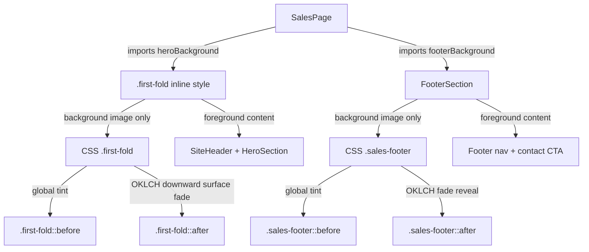

# First Fold + Footer OKLCH Fade Reveal — Planning Output (v3)

> **Status:** PLANEJADO — Aguardando aprovação  
> **Data:** 2026-06-10  
> **Scope:** `/` first fold background image + footer background image  
> **Files:** 2 arquivos (0 novos, 2 modificados)  
> **Risk:** 🟢 LOW

---

## 1. Contexto

The current first fold renders `heroBackground` through an inline `backgroundImage` stack in `src/App.tsx`, combining a simple RGBA white gradient and the background image in one declaration. The footer renders `footerBackground` as a direct inline background image and relies on a flat `background-color` from CSS. The requested adjustment is to model the premium OKLCH "Fade Reveal" pattern documented in `/Users/brunogovas/Projects/Vault/Vault/Tools/AI/AI Swipe File/documents/2026-06-10-oklch-gradient-fade.md` and apply that logic to both existing background images.

Technical mapping:

- **Issue:** The first fold uses a uniform linear RGBA wash, and the footer uses the background image without the modeled fade reveal. For the hero specifically, the fade direction must be inverted from the first proposed plan: the top of the image should remain visible, while the background surface color gains opacity as the eye moves downward.
- **Suspected Root Cause:** The first fold couples gradient and image in one inline `backgroundImage`; the footer binds only `url(${footerBackground})`. Neither section has separate mask layers with non-linear OKLCH alpha stops.
- **Target Outcome:** Keep the same `heroBackground` and `footerBackground` assets while moving reveal logic to CSS pseudo-elements. The hero uses an image-first top reveal that fades into an increasingly opaque light surface downward. The footer keeps the top surface-to-image reveal from the model.
- **Risks & Mitigation:** Low visual-only risk. Mitigate by preserving DOM structure, preserving current image assets, keeping overlays `pointer-events: none`, maintaining foreground stacking, and verifying build plus visual behavior for first fold and footer.

Context7 validation:

- MDN documentation confirms that CSS supports layering `linear-gradient(...)` above `url(...)` in `background`, multiple color stops in `linear-gradient`, and alpha in `oklch(... / alpha)`.

---

## 2. Referência de Código Mapeada

### 2.1 Current React Background Binding

[src/App.tsx](file:///Users/brunogovas/Projects/Projetos%20Solo/personal-sales-page/src/App.tsx#L211-L216)

```tsx
<div
  className="first-fold"
  style={{
    backgroundImage: `linear-gradient(rgba(255, 255, 255, 0.78), rgba(255, 255, 255, 0.9)), url(${heroBackground})`,
  }}
>
```

This will be adapted so React only binds the real image URL, while CSS owns the fade/tint logic.

### 2.2 Current First Fold CSS Surface

[src/App.css](file:///Users/brunogovas/Projects/Projetos%20Solo/personal-sales-page/src/App.css#L48-L54)

```css
.first-fold {
  min-height: 796px;
  background: #ffffff;
  background-position: center;
  background-size: cover;
  background-repeat: no-repeat;
}
```

This selector will be extended with `position`, `isolation`, and pseudo-element overlays. Existing sizing and image positioning will be preserved.

### 2.3 Model OKLCH Fade Logic

[/Users/brunogovas/Projects/Vault/Vault/Tools/AI/AI Swipe File/documents/2026-06-10-oklch-gradient-fade.md](file:///Users/brunogovas/Projects/Vault/Vault/Tools/AI/AI%20Swipe%20File/documents/2026-06-10-oklch-gradient-fade.md)

```tsx
<div className="absolute inset-0 bg-[oklch(0.2210_0.0394_258.2754/0.25)]" />

<div className="absolute inset-x-0 top-0 h-[420px] pointer-events-none bg-[linear-gradient(to_bottom,oklch(0.2210_0.0394_258.2754)_0%,oklch(0.2210_0.0394_258.2754/0.9)_18%,oklch(0.2210_0.0394_258.2754/0.45)_55%,transparent_100%)]" />
```

This model will be translated from Tailwind utility layers into plain CSS pseudo-elements for the existing Vite/React page.

### 2.4 Current Footer Background Binding

[src/App.tsx](file:///Users/brunogovas/Projects/Projetos%20Solo/personal-sales-page/src/App.tsx#L163-L169)

```tsx
function FooterSection() {
  return (
    <footer
      id="contato"
      className="sales-footer"
      style={{ backgroundImage: `url(${footerBackground})` }}
    >
```

This already binds only the real footer image URL. The implementation should preserve this binding and add the OKLCH reveal through CSS.

### 2.5 Current Footer CSS Surface

[src/App.css](file:///Users/brunogovas/Projects/Projetos%20Solo/personal-sales-page/src/App.css#L557-L569)

```css
.sales-footer {
  --footer-ink: #0d2444;
  --footer-muted: #4d657f;
  --footer-border: #a8b6c7;
  --footer-rule: #e6ecf2;

  background-color: var(--card);
  background-position: center;
  background-repeat: no-repeat;
  background-size: cover;
  color: var(--footer-ink);
  padding: clamp(56px, 8vw, 96px) clamp(24px, 6.67vw, 96px) 64px;
}
```

This selector will be extended with the same layering approach, using a top fade to blend from the preceding white page area into the footer image and a bottom/internal tint to keep footer text readable.

---

## 3. Lógica de Implementação

### 3.1 React Background Image Binding

**Origem:** `[REPO EXISTENTE]` + `[CRIADO]`

```tsx
<div
  className="first-fold"
  style={{
    backgroundImage: `url(${heroBackground})`,
  }}
>
  <SiteHeader />
  <HeroSection />
</div>
```

The React logic keeps the real asset imported from `./assets/hero-background.webp`, but stops embedding the fade algorithm inline.

### 3.2 CSS OKLCH Hero Downward Surface Fade

**Origem:** `[CONTEXT7]` + `[CRIADO]`

```css
.first-fold {
  --first-fold-surface: oklch(98.5% 0.006 247);

  isolation: isolate;
  min-height: 796px;
  overflow: hidden;
  position: relative;
  background-color: #ffffff;
  background-position: center;
  background-size: cover;
  background-repeat: no-repeat;
}

.first-fold::before,
.first-fold::after {
  content: '';
  pointer-events: none;
  position: absolute;
  z-index: 0;
}

.first-fold::before {
  inset: 0;
  background: oklch(98.5% 0.006 247 / 0.12);
}

.first-fold::after {
  inset-inline: 0;
  inset-block: 0;
  background: linear-gradient(
    to bottom,
    transparent 0%,
    oklch(98.5% 0.006 247 / 0.18) 24%,
    oklch(98.5% 0.006 247 / 0.58) 68%,
    oklch(98.5% 0.006 247 / 0.88) 100%
  );
}

.first-fold > * {
  position: relative;
  z-index: 1;
}
```

The `::before` layer keeps only a very light global softening so the top of the image remains visible. The `::after` layer implements the requested inverted/non-linear direction: image visibility is highest at the top, and the light surface color gains opacity as it moves downward. Content remains above the overlays.

### 3.3 Footer Background Binding

**Origem:** `[REPO EXISTENTE]`

```tsx
<footer
  id="contato"
  className="sales-footer"
  style={{ backgroundImage: `url(${footerBackground})` }}
>
```

The footer React binding is already correct. No JSX change is required for this section unless implementation review shows the inline style needs a CSS variable for stricter separation.

### 3.4 Footer CSS OKLCH Fade Reveal

**Origem:** `[CONTEXT7]` + `[CRIADO]`

```css
.sales-footer {
  --footer-ink: #0d2444;
  --footer-muted: #4d657f;
  --footer-border: #a8b6c7;
  --footer-rule: #e6ecf2;
  --footer-surface: oklch(98.5% 0.006 247);

  isolation: isolate;
  overflow: hidden;
  position: relative;
  background-color: var(--card);
  background-position: center;
  background-repeat: no-repeat;
  background-size: cover;
  color: var(--footer-ink);
  padding: clamp(56px, 8vw, 96px) clamp(24px, 6.67vw, 96px) 64px;
}

.sales-footer::before,
.sales-footer::after {
  content: '';
  pointer-events: none;
  position: absolute;
  z-index: 0;
}

.sales-footer::before {
  inset: 0;
  background: oklch(98.5% 0.006 247 / 0.46);
}

.sales-footer::after {
  inset-inline: 0;
  top: 0;
  height: min(420px, 70%);
  background: linear-gradient(
    to bottom,
    var(--footer-surface) 0%,
    oklch(98.5% 0.006 247 / 0.9) 18%,
    oklch(98.5% 0.006 247 / 0.42) 55%,
    transparent 100%
  );
}

.sales-footer > * {
  position: relative;
  z-index: 1;
}
```

The footer reveal keeps the footer image as the base layer, adds a restrained OKLCH tint, and blends the top of the footer into the preceding page background before revealing the image.

---

## 4. Arquitetura de Componentes



---

## 5. CSS/SCSS Reference

### 5.1 Existing First Fold Styling

[src/App.css](file:///Users/brunogovas/Projects/Projetos%20Solo/personal-sales-page/src/App.css#L48-L54)

```css
.first-fold {
  min-height: 796px;
  background: #ffffff;
  background-position: center;
  background-size: cover;
  background-repeat: no-repeat;
}
```

**Adaptações necessárias:**

| Propriedade | Valor Original | Novo Valor |
|-------------|---------------|------------|
| `background` | `#ffffff` | `background-color: #ffffff` |
| `position` | absent | `relative` |
| `isolation` | absent | `isolate` |
| `overflow` | absent | `hidden` |
| pseudo-elements | absent | `::before` light tint + `::after` transparent-to-surface OKLCH fade |

### 5.2 Existing Footer Styling

[src/App.css](file:///Users/brunogovas/Projects/Projetos%20Solo/personal-sales-page/src/App.css#L557-L569)

```css
.sales-footer {
  --footer-ink: #0d2444;
  --footer-muted: #4d657f;
  --footer-border: #a8b6c7;
  --footer-rule: #e6ecf2;

  background-color: var(--card);
  background-position: center;
  background-repeat: no-repeat;
  background-size: cover;
  color: var(--footer-ink);
  padding: clamp(56px, 8vw, 96px) clamp(24px, 6.67vw, 96px) 64px;
}
```

**Adaptações necessárias:**

| Propriedade | Valor Original | Novo Valor |
|-------------|---------------|------------|
| `background-color` | `var(--card)` | preserved |
| `position` | absent | `relative` |
| `isolation` | absent | `isolate` |
| `overflow` | absent | `hidden` |
| `--footer-surface` | absent | `oklch(98.5% 0.006 247)` |
| pseudo-elements | absent | `::before` tint + `::after` OKLCH fade |

---

## 6. Novos Componentes

No new components. This is a styling-only adjustment on the existing `SalesPage` first fold and `FooterSection`.

---

## 7. Componentes Modificados

### 7.1 App.tsx

**Novos states/hooks:**

```ts
// None.
```

**Modificações no código existente:**

```tsx
style={{
  backgroundImage: `url(${heroBackground})`,
}}
```

**Props adicionais para sub-componentes:**

```tsx
// None.
```

### 7.2 App.css

The `.first-fold` selector will receive the inverted OKLCH fade pseudo-elements shown in section 3.2. The `.sales-footer` selector will receive the footer-specific OKLCH fade reveal pseudo-elements shown in section 3.4.

---

## 8. i18n Keys (se aplicável)

Not applicable. No copy changes.

### 8.1 Novas Chaves

```json
{}
```

### 8.2 Plano de Verificação Anti-Reversão

```bash
npm run build
```

---

## 9. Files Summary

| Action | File | Risk |
|--------|------|------|
| **MODIFY** | `/Users/brunogovas/Projects/Projetos Solo/personal-sales-page/src/App.tsx` | 🟢 LOW |
| **MODIFY** | `/Users/brunogovas/Projects/Projetos Solo/personal-sales-page/src/App.css` | 🟢 LOW |

---

## 10. Implementation Order

1. **Phase A:** Update `src/App.tsx` so the first fold inline style only binds `url(${heroBackground})`.
2. **Phase B:** Extend `.first-fold` in `src/App.css` with `position`, `isolation`, `overflow`, `::before`, `::after`, and foreground stacking. The hero gradient must start transparent at the top and increase light surface opacity toward the bottom.
3. **Phase C:** Extend `.sales-footer` in `src/App.css` with the matching OKLCH overlay structure while preserving the current `footerBackground` binding in `src/App.tsx`.
4. **Phase D:** Run `npm run build`; if visual verification is requested after approval, open the local route and inspect the first fold and footer.

---

## 11. Rollback Plan

```text
Componentes modificados:
├── Git Ref: HEAD antes da implementação
├── Revert: git checkout <ref> -- src/App.tsx src/App.css
└── Validação: npm run build; reload / and confirm previous first-fold wash and footer image rendering are restored
```

---

## 12. Verification Plan

| # | Test Case | Route | Expected |
|---|-----------|-------|----------|
| 1 | Production build | `/` | `npm run build` completes successfully |
| 2 | First fold background | `/` | Top of hero background image remains visible; light background surface gains opacity downward |
| 3 | Footer background | `/` | Footer background image remains visible with smooth top fade into the section |
| 4 | Header and hero interactions | `/` | Navigation, CTA hover/focus, and mobile menu remain clickable |
| 5 | Footer interactions | `/` | Footer nav links and contact CTA remain clickable |
| 6 | Responsive first fold | `/` at <= 640px | Text remains above overlay and no content overlap is introduced |
| 7 | Responsive footer | `/` at <= 767px | Footer text remains readable above overlay and no layout shift is introduced |

---

## 13. Handoff (se aplicável)

No external integration handoff required.

### 13.1 Implementation Notes

> **Status:** IMPLEMENTADO — verificado  
> **Data:** 2026-06-10

- `src/App.tsx`: first fold inline background was reduced to `url(${heroBackground})`, so CSS now owns the overlay logic.
- `src/App.css`: `.first-fold` received the inverted OKLCH fade: image remains visible at the top and the light surface gains opacity downward.
- `src/App.css`: `.sales-footer` received the OKLCH overlay structure from the model, with tint and top fade while preserving the existing `footerBackground` binding.

### 13.2 Verification Results

| Gate | Status | Notes |
|------|--------|-------|
| Production build | Passed | `npm run build` completed successfully; Vite emitted an existing Lightning CSS warning for `@theme`, but build finished |
| Lint | Passed | `npm run lint` completed successfully |
| Desktop visual check | Passed | Hero top image remains visible; footer background reveals under a light top fade |
| Mobile visual check | Passed | 390px viewport keeps hero/footer text readable and footer links/CTA visible |
| Console check | Passed | No browser warning/error logs captured after verification |
